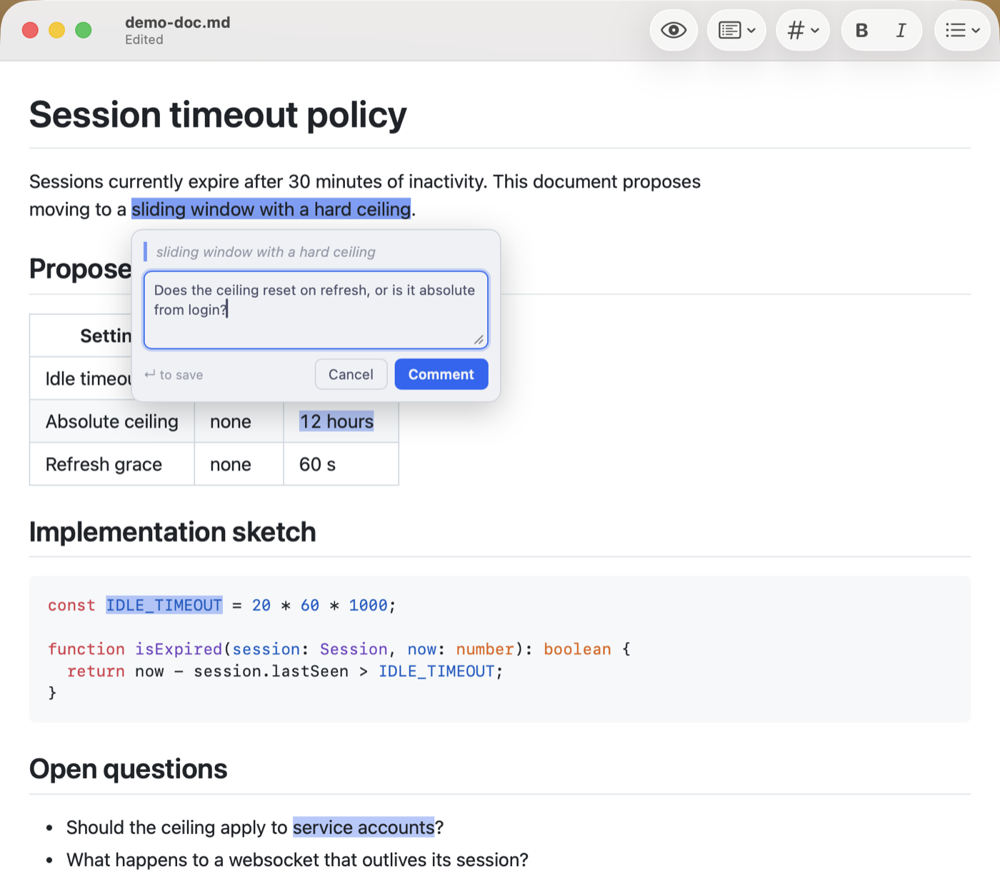

# MarkEdit-comments

Anchored review comments in [MarkEdit](https://github.com/MarkEdit-app/MarkEdit)'s preview.

Select text in the preview, start typing, and the comment attaches to what you
selected. Comments are stored **in the Markdown file itself**, so an agent you are
working with can read your review straight from the document.



## Why comments are stored the way they are

There is no standard for *anchored comments* in Markdown. There is a standard for
anchored annotations in general: the
[W3C Web Annotation Data Model](https://www.w3.org/TR/annotation-model/)
(Recommendation, 2017), whose `TextQuoteSelector` identifies a passage by quoting
it — `exact`, plus the `prefix` and `suffix` that disambiguate it when the quoted
words repeat.

That is also, in substance, how GitHub anchors a pull request review comment: not
inside the file, but by `path` + `line` + `side`, alongside a saved copy of the
surrounding `diff_hunk` used to re-anchor the comment when the file moves on (and
to mark it *outdated* when it cannot).

This extension takes that model and puts it in the file:

```markdown
The quick brown fox jumps over the lazy dog.

<!-- annotation
id=c1 author="anchit.rao" created="2026-08-26T18:04:00Z" line=2
exact="brown fox" prefix="The quick " suffix=" jumps over the lazy dog."

Cliché — pick a concrete example instead.
-->
```

Nothing is written inline. The highlight is re-derived on each render by finding
the quote again.

### Why not inline markers

The alternatives write *into* the prose, and that is where they break. Rendering
every candidate through the same markdown-it configuration MarkEdit-preview uses,
across twelve Markdown constructs:

| Format | Result |
| --- | --- |
| CriticMarkup `{==x==}` | Visible braces leak into the output in **12 of 12** constructs. Invisible only where a CriticMarkup processor is installed; on GitHub and in VS Code it is literal junk. |
| Paired HTML comments `<!--@c1-->x<!--/@c1-->` | Clean in 9 of 12. **Breaks in fenced code, indented code and inline code**, where it renders verbatim as `const x = "&lt;!--@c1--&gt;brown fox&lt;!--/@c1--&gt;"`. |
| This format (nothing inline) | Cannot break any construct, because it never touches the content. |

No inline scheme can annotate code at all. This one can.

Placement matters too. A comment block is only inert when it sits at column zero
between two top-level blocks: indented into a list it changes the paragraph
structure, dropped between table rows it truncates the table, nested in a
blockquote it mangles it. The extension always writes at column zero, with a blank
line either side.

## Installing

### Requirements

- **MarkEdit** — [download](https://github.com/MarkEdit-app/MarkEdit/releases/latest)
  or `brew install --cask markedit`. Developed and tested against 1.34; 1.29 or
  later is recommended, since that is where `getDirectoryPath` (used to derive the
  default comment author) arrived.
- **MarkEdit-preview** — install from the
  [extension registry](https://markedit-app.github.io/extensions/#markedit-preview).
  This extension draws into the preview pane that one creates, so it does nothing
  without it.

### Install the prebuilt script

Download [`dist/markedit-comments.js`](dist/markedit-comments.js), then:

```sh
mkdir -p ~/Library/Containers/app.cyan.markedit/Data/Documents/scripts
cp markedit-comments.js ~/Library/Containers/app.cyan.markedit/Data/Documents/scripts/
```

Restart MarkEdit. That folder is MarkEdit's user-script directory; every `.js`
file in it is loaded at launch.

To open the folder in Finder instead:

```sh
open ~/Library/Containers/app.cyan.markedit/Data/Documents/scripts
```

### Or build from source

Requires Node 20 or later.

```sh
git clone https://github.com/anchitrao/markedit-comments.git
cd markedit-comments
npm install
npm run build     # builds, and copies the script into the scripts folder for you
npm run reload    # quit and relaunch MarkEdit
```

### Check that it loaded

Open a Markdown file, switch to the preview (`Shift`-`Command`-`V`), and look for
**Comments** under the `Extensions` menu. Then select a few words in the preview —
a composer should open under them.

If the menu is missing, confirm the file is in the scripts folder and that
MarkEdit was restarted; scripts are read only at launch.

### Uninstalling

```sh
rm ~/Library/Containers/app.cyan.markedit/Data/Documents/scripts/markedit-comments.js
```

Restart MarkEdit. Comments already written stay in your Markdown files as inert
HTML comments; they will simply stop being drawn.

## Using it

- **Comment** — select text in the preview and start typing. Return saves,
  Shift-Return adds a line, Escape cancels.
- **Open a thread** — click a highlight. Reply, resolve, or delete from there.
  Deleting a comment deletes its replies.
- **Navigate** — `Extensions ▸ Comments ▸ Next / Previous Comment`.
- **Hand the review to an agent** — the comments are in the file, so "read my
  comments in `notes.md`" is enough. `Copy All Comments` puts them on the
  clipboard as plain text when you would rather paste than point at a path.

Highlight colors are taken from the editor theme you have set — the extension
measures the theme's own search-match and accent colors rather than hard-coding
its own, and re-measures when you change theme or when the system switches
between light and dark.

### When the text changes underneath a comment

If the quoted text is edited away, the comment is not lost. It falls back to the
block it was written against, is drawn as an underline instead of a highlight, and
is badged **outdated** in its thread — the same thing GitHub does with a review
comment whose diff has moved. The recorded selector stays in the file, so the
comment still says what it was about.

## Settings

In MarkEdit's
[settings.json](https://github.com/MarkEdit-app/MarkEdit/wiki/Customization#advanced-settings):

```json
{
  "extension.markeditComments": {
    "author": "anchit.rao",
    "openOnSelect": true,
    "showResolved": true
  }
}
```

- `author` — name recorded on new comments. Defaults to your account name. Set it
  to distinguish a reviewer, or an agent, from you.
- `openOnSelect` — open the composer as soon as text is selected. Set to `false`
  to use only `Comments ▸ Comment on Selection`.
- `showResolved` — keep drawing resolved comments in the preview.

## The format in full

An annotation is an HTML comment block. Attributes run from the opening line to
the first blank line; everything after it is the comment body, which may contain
blank lines of its own.

| Attribute | Meaning |
| --- | --- |
| `id` | Identifier, unique within the document. |
| `exact` | The quoted text, whitespace-normalized. |
| `prefix`, `suffix` | Surrounding context, used to pick the right occurrence. |
| `line` | Source line when written. A hint for tie-breaking; not authoritative. |
| `author`, `created` | Who wrote it, and when (ISO 8601). |
| `reply-to` | Present on replies; the `id` being answered. Replies carry no selector. |
| `resolved` | `true` when resolved. |

Quoted values are JSON strings, so quotes, backslashes and pipes round-trip
unchanged. A literal `-->` inside a body is escaped as `--\>`.

See [`example/sample-with-comments.md`](example/sample-with-comments.md).

## Reading comments as an agent

The comments are plain text in the file. To act on a review:

1. Read the document.
2. Each `<!-- annotation ... -->` block is one comment. `exact` is the text it
   refers to; the body is the request.
3. Blocks with `reply-to` are replies to the block with that `id`.
4. Blocks with `resolved=true` are already dealt with.
5. After addressing one, either delete its block or add a reply block with
   `reply-to` set — both are valid, and MarkEdit will re-render either way.

Editing the quoted text will mark the comment outdated rather than orphan it, so
it is safe to revise the prose first and clean up the comments afterwards.

## Development

```sh
npm test        # format, anchoring and placement tests
npm run lint
npm run typecheck
npm run build
```

Anchoring is tested against markdown actually rendered by markdown-it in the same
configuration the preview uses, and placement is tested against an in-memory
document, because those are the two places where a bug would corrupt a file.

## License

MIT
